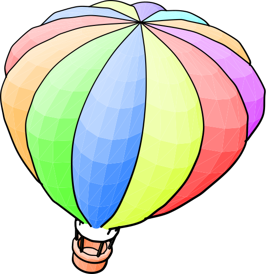
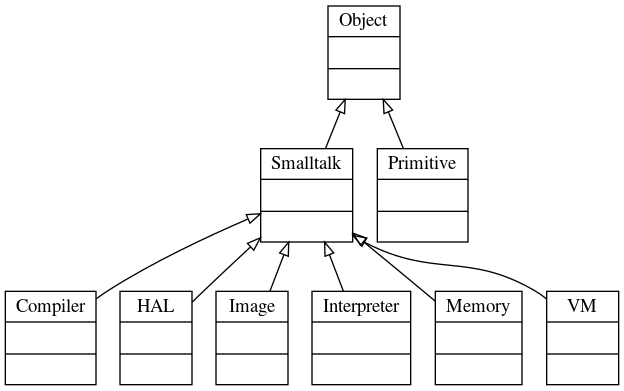

#  `Smalltalk`
## Smalltalk language model /cPython implementation/

* Stéphane Ducasse [Free Online Smalltalk Books](http://stephane.ducasse.free.fr/FreeBooks.html)
  * Adele Goldberg, David Robson, Michael A. Harrison
    **Smalltalk-80: The Language and its Implementation**
    [pdf](http://stephane.ducasse.free.fr/FreeBooks/BlueBook/Bluebook.pdf)
  * Timothy Budd
    **A Little Smalltalk**
    [pdf](http://sdmeta.gforge.inria.fr/FreeBooks/LittleSmalltalk/ALittleSmalltalk.pdf)
* powered by `metaL`

(c) Dmitry Ponyatov <<dponyatov@gmail.com>> 2020 MIT License

github: https://github.com/ponyatov/metaL/Smalltalk

