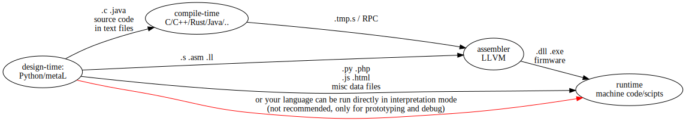

# How hard is it to develop your own programming language? Is it worth it? {#quora}

* LinkedIn: https://www.linkedin.com/posts/dmitry-ponyatov-060646a4_metal-python-programminglanguage-activity-6705018983097090048-9rqm
* Answering on: https://qr.ae/pN2BWT

It is not hard but needs a huge of work to make it practical.

First, forget about the syntax -- it is a mostly solved problem, almost any
language has 1+ library for making syntax parsers. If you like Python, the [PLY
library](https://www.dabeaz.com/ply/) gives you a full set of syntax support.
Furthermore, **you can drop out syntax parser totally**, by using your host
(implementation) language for building AST trees or any other interpretable data
structures.

Next, avoid building the classical compiler, it is boring and very limited
language pattern. Look closely on the C++, it was originally the pure compiler,
but last decade it has become an ill-headed interpreter works on templating/type
engine. Yes, it runs some sort of code in compile-time, but the "language" of
his metaprogramming code with its semantics and syntax will burn your brain, and
you have no tools do debug it.

Don't forget: **any programming language interpreter can compile** into the fastest
machine code, or any other language you want to use (assembly, LLVM, C/C++,
Java,..., anything you want including build scripts and SQL): write text files,
and compile them with any backend compiler. 



https://qph.fs.quoracdn.net/main-qimg-5c808ff9efeceaaf36594459a0433edb

* Write your own interpreter,.. NO! Just use any host (implementation) language
  you like to use, preferred dynamic, like Python JavaScript Clojure Haskell ...
* Find some data structure that can represent programs -- I prefer [object
  graphs](https://en.wikipedia.org/wiki/Object_graph), they can natively
  represent anything from target language AST/attribute grammar to any models
  from the application domain and software architect concepts.
* Write a set of `.compile_to_*()` methods for this data structure, which are
  able to compile every object graph node type into target code you want to use
  (LLVM, assembly, C, Python code for Django stack + JavaScript,..) -- now you
  can compile your data structure into the target language. Note here, **your
  models are able to compile itself**, by *generating code*.
* Now, you already can compile code, using your/host language interpreter (I use
  generic Python) as a compiler. *Factically, you already wrote your language
  without writing it*. You can build software systems by describing its
  structure, can build models, can create target language AST tree in host
  language element by element, and then run `AST.compile()` method and get C++
  code for backend compiling. At this point, you already have your own **working
  language** version, even without syntax parser (host language does it for you
  off the shelf).
* Next, use your language for writing applications. Doing this, you are testing
  your language on real problems, and extend it every time you want. It is the
  most annoying stage or your language evolution. The most nuisance is writing a
  lot of code in the host language. It has syntax you are not adopted as ideal,
  but you must do it because it has a working debugger (the must-have tool,
  nothing works without it) and because your "language" (as a concept defined
  over the data structure semantics) not yet defined at these use cases.
* While your (meta)language evolves, you find yourself making some sort of code
  patterns, some concepts repeat again and again. That is **the advantage of
  this complex method -- you can unlimitedly and freely expand your language
  semantics**, especially if your host language has rich inheritance
  capabilities (like Python with its multiple inheritance, operators override,
  and dynamics).
* Finally, the most magic stage arrived. Your data structures that represent
  your code and data simultaneously
  ([homoiconic](https://en.wikipedia.org/wiki/Homoiconicity)!) are active
  **executable data structures**, which runs by self-interpretation. You can
  apply one object graph to another graph even itself, and you have got
  code/data *transformations* and program *self-modification* in hands.
* It is time to dive into classical computer science:
  [SICP](https://mitpress.mit.edu/sites/default/files/sicp/full-text/book/book.html),
  [PLAI](https://www.plai.org/) and [PAPL](https://papl.cs.brown.edu/2020/),
  algorithms, software design templates, and
  [TAPL](https://www.cis.upenn.edu/~bcpierce/tapl/). Don't fix on strange
  programming languages these books use. *Concentrate not on syntax, but on
  ideas and semantics* of that code blocks. If you can understand it, then you
  can reimplement it yourself and use it in real work. Some concepts described
  in these books are very powerful in programming but unfortunately not
  available if your favorite mainstream languages, such as pattern matching or
  logic unification. However, it is not now a problem -- you already implemented
  the level of **language abstraction**, because you write code with looks for
  others like complex code in Python, but factically you are writing in your own
  language. So, you just can steal that magic into your universe.

## So, let's overall.

### Disadvantage: the complexity of the method.

Yes, a huge one, but only in later stages. At first stages, you just copy-paste
some parts of target languages as strings (most software projects use multiple
languages: code, build/deployment/maintenance scripts, JS/HTML, SQL,..),
sometimes with replacing tiny elements in these string in Python code, and write
them into outer text files. It looks easy even for the newbie: only string
interpolation and text file writing.

The next stage of evolving you as a programmer is the data structures kneading.
Also looks like a generic skill of any programmer: manipulation with a graph of
objects, which references each other, sometimes cyclically. It is not scary, it
used almost in any practical software system everywhere. You even have an
advantage here: *object graph is a unified data structure*, any object node is
an instance inherited from the base Object class, and you can works with them
via unified interfaces. Every inherited class has its own behavior, but all of
them share the same single concept: attributed grammar tree (graph). Every
object is a data container (even Primitive ones), every node can have arbitrary
attributes bound to other object graphs, and every node can have ordered
subgraphs:

```py
# base object graph node 
class Object: 
    # construct object 
    # param[in] V given scalar value 
    def __init__(self, V): 
            if isinstance(V, Object): V = V.val 
        # symbol name / scalar value (string, number,..) 
            self.val = V 
        # slots = attributes = dict = env 
            self.slot = {} 
        # nested AST = vector = stack = queue 
            self.nest = [] 
        # global storage id 
            self.gid = self.sync().gid 
```

Next, you define new node classes, which you are need of. And, for every class,
you must define methods of code generation, and operator-like methods, when you
combine two objects in some manner. Python has operators override, some other
languages do it too: you can define custom operators for building data
structures like pushing one object into another, and get/set slots (attributes).
You can [look here](https://repl.it%2F@repl.it/@metaLmasters/metaL#metaL.py) as
I do it.

The complexity rises, but in a smooth curve. You can stay on this step as long
as you want or forever. If you are satisfied with the level of the **generic
code templating** you have now, it is enough. You also can wrap it with syntax
sugar using a [custom syntax parser generator](https://www.dabeaz.com/ply/), fix
your language semantics, and focus only on application programming. Maybe you
should read a bit
[SICP](https://mitpress.mit.edu/sites/default/files/sicp/full-text/book/book.html)
as en evening reading, just to have an idea what features you are not using.

### Advantages on the other side:

* **generic code templating**: you don't need to write almost the same code
  again and again 
* **concept abstraction**: you can describe elements of software design in short
  terms, but generate a large target code which implements it write fastest
* **low-level code in the highest-level scripting language**: Python-written
  code can be as fast as C and assembly in case you *know how to use it right*
* **freedom of programming thinking**: you can use any methods in programming
  but not depend on the software/language stack which your team use and employer
  require -- they'll get the code in the language they want
